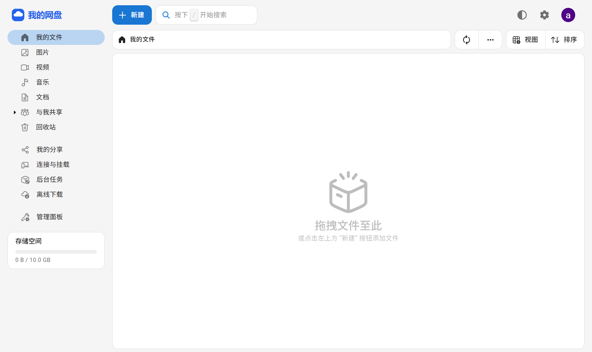

# 我的网盘 · My Cloud Drive

基于 [Cloudreve Community](https://github.com/cloudreve/cloudreve) 的个人网盘部署项目：中文界面、开放注册、文件上传下载和分享，所有用户共用一个 **10 GiB 存储池**。

[访问网盘](https://121.43.101.242/) · [部署说明](docs/DEPLOY.md) · [验证范围](VALIDATION.md) · [下载部署包](https://github.com/wobuyaoquminga/my-cloud-drive/releases)



## 可以做什么

- 邮箱与密码注册、图片验证码、用户登录。
- 文件和文件夹上传下载、分享、回收站及基础在线预览。
- 普通用户只能编辑自己的文件；管理员可在 `/manage` 管理全站文件，账号设置仍在 `/admin`。
- 支持 UTF-8 文本在线编辑（单文件最大 2 MiB）；其他文件可下载、改名和删除。
- 修改站点名称与图标，使用 Nginx 提供 HTTPS。
- 独立系统用户和 MySQL 数据库账号，systemd 自启动与进程资源限制。

本仓库提供部署脚本及配置，不包含 Cloudreve 本体源代码或二进制文件。安装脚本下载官方 **4.19.1** 发布包并检查 SHA-256。脚本支持 Ubuntu 24.04、Linux x86_64，需要已有 MySQL 8、Nginx、HTTPS 证书和 sudo/root 权限。

v1.1.0 另提供可选的 Cloudreve 管理后台内容编辑补丁。安装器仍安装官方二进制；补丁需在电脑上用 Python 3、Git 和 Go 1.26.5 单独构建，再按部署说明手动替换服务端程序。补丁基于 GPL-3.0，和本仓库 MIT 部署脚本许可不同。

## 容量与当前限制

所有用户合计使用一个 10 GiB 文件系统，含上传文件、回收站及临时文件；格式化后实际可用约 9.8 GiB。网页显示的个人上限 10 GB 不代表为每人提供独立的 10 GB 存储。

目前未接入 SMTP 邮件服务，因此没有邮件验证或邮件找回密码；Office 转换、视频缩略图和离线下载组件也未配置。当前部署使用公网 IP 与短期 HTTPS 证书，后续可换成自己的域名。

## 开始部署

请先阅读 [完整部署说明](docs/DEPLOY.md)。初始化必须通过本机或 SSH 隧道完成，首个注册账号是管理员；管理员初始化完成后再配置公网入口。

```sh
sudo python3 deploy/install.py
```

安装脚本会创建独立数据库、系统用户及 10 GiB 存储镜像；已有 Cloudreve 配置、数据库或存储时会拒绝覆盖。不要将这条命令直接用于升级既有实例。

## 项目内容

- `deploy/`：安装、初始化、Nginx、容量隔离、备份和公网验证工具。
- `docs/images/`：已部署实例的真实界面截图。
- `VALIDATION.md`：实际验证结果与范围。
- `SECURITY.md`：凭据与运行数据的处理方式。
- `patches/`、`deploy/build-admin.py`：可选 Cloudreve 管理后台补丁及本地构建工具。

部署脚本采用 MIT 许可证；Cloudreve 本体遵循其 [GPL-3.0 许可证](https://github.com/cloudreve/cloudreve/blob/master/LICENSE)，详见 [NOTICE.md](NOTICE.md)。
