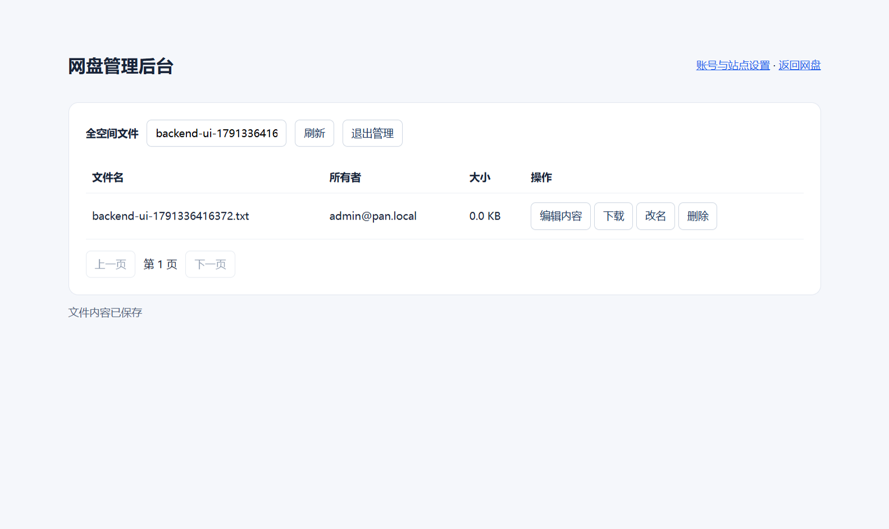

# 验证范围

2026-10-07 管理权限更新已部署到原实例。使用 Cloudreve 4.19.1 固定源码及本仓库补丁编译，复用经校验的官方前端资源。以下新增验证通过：

- 用两个临时普通账号验证：能上传和编辑自己的文件，不能列出、编辑、改名或删除另一账号文件。
- 普通用户不能访问全空间后台，也不能调用管理员内容编辑接口；未登录访客不能上传。
- 管理员可修改其他账号（包括停用账号）文件内容，并验证下载后的内容一致；可改名和删除。
- 过期版本保存被拒绝；管理员代编辑未改变普通用户组权限。
- 真实浏览器完成 `/manage` 登录、文件名筛选、打开文本编辑器、保存和下载验证。
- 临时验证账号及文件已删除；Nginx 检查通过，Chat 接口仍返回 401、状态页可访问。
- 更新前已备份网盘数据库、数据和配置，旧程序保留供回滚。首次部署的健康检查触发了程序回滚，修正后重新部署成功；这不等于完整数据恢复演练。

权限检查工具默认会创建、修改并清理测试账号和文件，不改站点设置。`--apply` 还会开启验证码注册、固定默认普通组、调整组权限和关闭匿名分享下载。页面在线编辑仅支持 2 MiB 以内的 UTF-8 文本；没有测试真正同时发生的文件移动/编辑、高负载及所有格式预览。



2026-10-06，原始部署在 Ubuntu 24.04 x86_64、MySQL 8、Nginx 环境完成。使用 Cloudreve Community 4.19.1 官方 Linux 发布包，SHA-256：

```text
287a1f59adb1249af15cd550b191d2fa71132bfd125fead8578f20152c4b99de
```

已通过：

- 普通用户注册、登录与分组。
- 普通用户无法访问管理员接口。
- 中文文件名和中文内容上传、列出、下载及内容哈希一致性。
- 各账号默认文件隔离。
- 未通过验证码的注册请求被拒绝；浏览器正确显示验证码。
- 真实浏览器加载中文登录页、注册页、自定义 logo，以及管理员登录后的文件管理页面。
- 经过公网 HTTPS/Nginx 上传并下载 1 MiB 文件，字节完全一致，验证文件已删除。
- Chat 公网受保护接口继续返回 401，状态页保留，服务仍在运行。
- 初始一致性备份已创建；数据库备份 gzip 完整性检查通过。

公开仓库移除了实例凭据与电脑路径，并对脚本增加参数。公开版本做了语法检查和敏感文件排除检查；未在第二台服务器重新部署，不能把原始实例的通过结果当成任意环境的安装保证。

尚未验证：多人并发及高负载、写满整个存储池、重启机器后的挂载、备份恢复、邮件服务，以及本次路由变化后的两客户端真实通话。没有测试 Office 转换、离线下载或高级缩略图组件。
